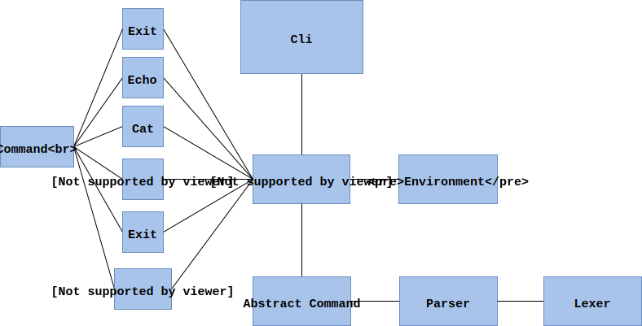

Логика работы:

1. Строка подается на вход парсеру. Он разбирает слова на лексемы и строит список из абстрактных команд: имя и список аргументов.
2. Во все переменные внутри этих аргументов подставляются значения, которые хранятся в некотором словаре (Environment).
3. Все абстрактные команды становятся конкретными (echo, cat и т.д.)
4. Каждая конкретная команда одна за одной выполняется.
5. Результирующий выходной поток или сообщение выводится на экран

Краткая документация:

#### CLI
    class Cli(builtins.object)
     |  Methods defined here:
     |
     |  main(self)
     |      обеспечивает основной цикл ввода команд интерпретатора
     |

#### Commands

    class Command(abc.ABC)
     |  абстрактный класс конкретной команды
     |
     |  Methods defined here:
     |
     |  __init__(self, args)
     |
     |  run(self, input_stream, env)
     |

    class Assignment(Command)
     |  команда присваивания
     |  например, x=5
     |
     |
     |  run(self, input_stream, env)
     |

    class Cat(Command)
     |  команда cat чтения файла и вывода в поток
     |  например, cat "example.txt"
     |
     |
     |  run(self, input_stream, env)
     |

    class Echo(Command)
     |  команда echo вывода в поток
     |  например, echo 5
     |
     |  Methods defined here:
     |
     |  run(self, input_stream, env)
     |

    class Exit(Command)
     |  команда exit выхода из консоли
     |  например, exit
     |
     |  Methods defined here:
     |
     |  run(self, input_stream, env)
     |

    class External(Command)
     |  внешняя команды
     |  например, git status
     |
     |  Methods defined here:
     |
     |  run(self, input_stream, env)
     |

    class Pwd(Command)
     |  команда pwd отображает текущую рабочую директорию
     |  например, pwd
     |
     |  Methods defined here:
     |
     |  run(self, input_stream, env)
     |

    class Wc(Command)
     |  команда wc - отображает число строк, слов, байт в файле
     |  например, wc "example.txt"
     |
     |  Methods defined here:
     |
     |  run(self, input_stream, env)
     |

     class CommandResult(builtins.object)
      |  описывает результат работы каждой команды
      |  хранит в себе выходной поток
      |
      |  Methods defined here:
      |
      |  __init__(self, output_stream='')
      |

#### Environment

    class Environment(builtins.object)
     |  хранит ив себе окружение:
     |  текущую рабочую директорию и словарь переменных
     |
     |  Methods defined here:
     |
     |  __init__(self)
     |      Initialize self.  See help(type(self)) for accurate signature.
     |
     |  add_var(self, name, value)
     |      добавляет переменную в словарь
     |      :param name: имя переменной
     |
     |  get_cur_dir(self)
     |      :return: возвращает текущую рабочую директорию
     |
     |  get_var(self, name)
     |      :param name: имя переменной
     |      :return: значение переменной
     |

#### Exceptions

    class CommandExternalException(builtins.Exception)
     |  исключение при работе с внешними командами

    class CommandFileException(builtins.Exception)
     |  исключение при работе с файлами

    class LexerException(builtins.Exception)
     |  исключение лексера

    class ParserException(builtins.Exception)
     |  исключение парсера

#### Interpreter

    class Interpreter(builtins.object)
     |  содержит основную логику работы интерпретатора
     |
     |  Methods defined here:
     |
     |  from_abstract_to_concrete(self, commands)
     |      получает из исходного списка абстрактных команд(имя и параметры) конкретные команды (echo, cat и тд)
     |      :param commands: список абстрактных команд
     |      :return: список конкретных команд
     |
     |  interpolation_command(self, command, env)
     |      подставляет аргументы внутрь переменной одной абстрактной команды
     |      :param command: абстрактная команда с переменными в аргументах
     |      :param env: окружение
     |      :return: абстрактная команда со значениями в агрументах
     |
     |  interpolation_commands_list(self, commands, env)
     |      подставляет аргументы внутрь переменной списка абстрактных команд
     |      :param commands: список абстрактных команд с переменными в аргументах
     |      :param env: окружение
     |      :return: список абстрактных команд со значениями в агрументах
     |
     |  run_commands_list(self, commands, env)
     |      последовательно запускает каждую из списка конкретных команд
     |      и выводит на экран результирующий выходной поток
     |      :param commands: список конкретных команд
     |      :param env: окружение
     |

#### Lexer

    class Type(enum.Enum)
     |  Тип перечисление для всех видов токенов
     |
     |  Data and other attributes defined here:
     |
     |  ASSIGNMENT
     |  EOF
     |  ONE_QUOTE
     |  PIPE
     |  STRING
     |  TWO_QUOTES
     |

    class Token(builtins.object)
     |  Тип токена(лексемы) для лексера.
     |  Хранит (тип токена, значение токена)
     |

     class Lexer(builtins.object)
      |  Лексер для лексического разбора команды
      |
      |  Methods defined here:
      |
      |  __init__(self, text)
      |      инициализируется входным текстом команд
      |
      |  get_next_token(self)
      |      :return:
      |      Возвращает следующий токен (EOF - если токенов больше нет).
      |
      |  next_char(self)
      |      Следующий символ для рабора
      |
      |  skip_whitespace(self)
      |      Пропуск пробелов
      |
      |  string(self)
      |      Осуществляет поиск токена-строки (последовательность символов,
      |      отличных от " ", "=", "|", "'", """ )

#### Parser

    class AbstractCommand(builtins.object)
     |  абстрактная команда интерпретатора
     |  хранит только имя и аргументы
     |
     |  Methods defined here:
     |
     |  __init__(self, name, args=None)
     |
     |  add_arg(self, arg)
     |      добавляет аргумент к списку аргументов

    class Parser(builtins.object)
     |  Methods defined here:
     |
     |  __init__(self, lexer)
     |      инициализируестся лексером
     |
     |  command(self)
     |      :return: возвращает AbstractCommand (имя команды, [параметры])
     |
     |  expr(self)
     |      выражения в соответствии с грамматикой
     |
     |      expr            : command (PIPE command)*
     |      command         : (param param*) | (param ASSIGNMENT param)
     |      param           : STRING |
     |                          (ONE_QUOTE STRING* ONE_QUOTE) |
     |                          (TWO_QUOTES STRING* TWO_QUOTES)
     |
     |  param(self)
     |      :return: возвращает строку-параметр команды
     |
     |  parse(self)
     |
